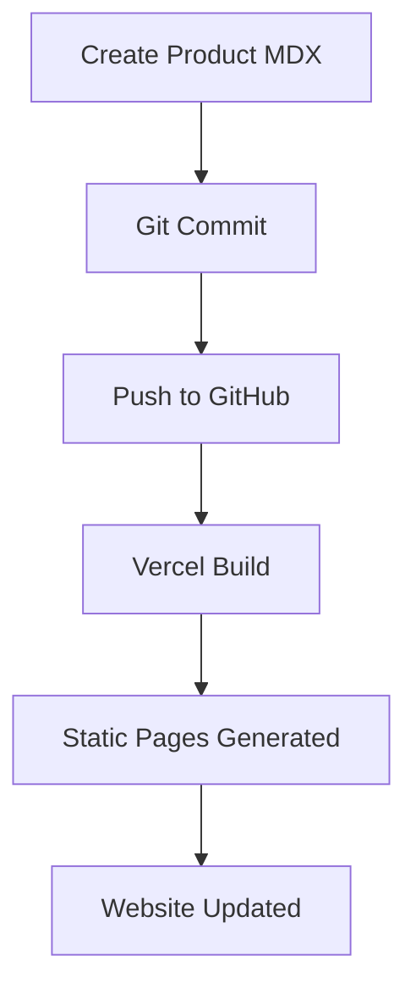
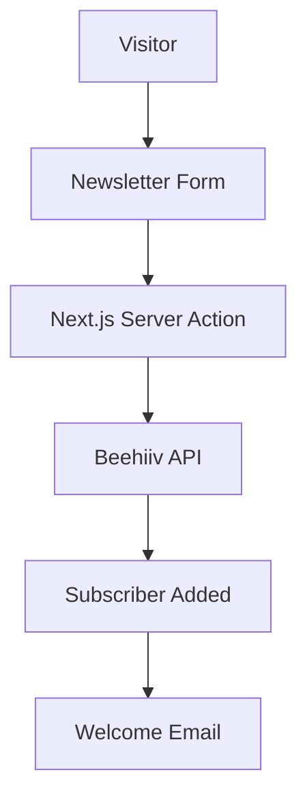
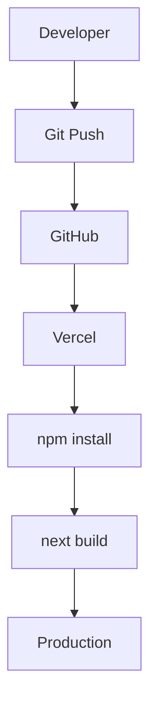
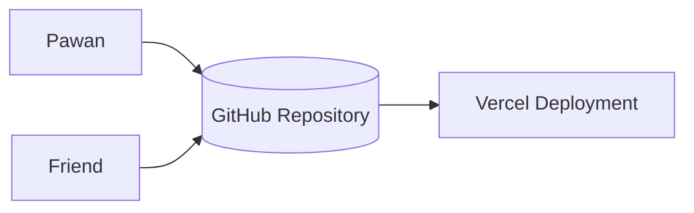
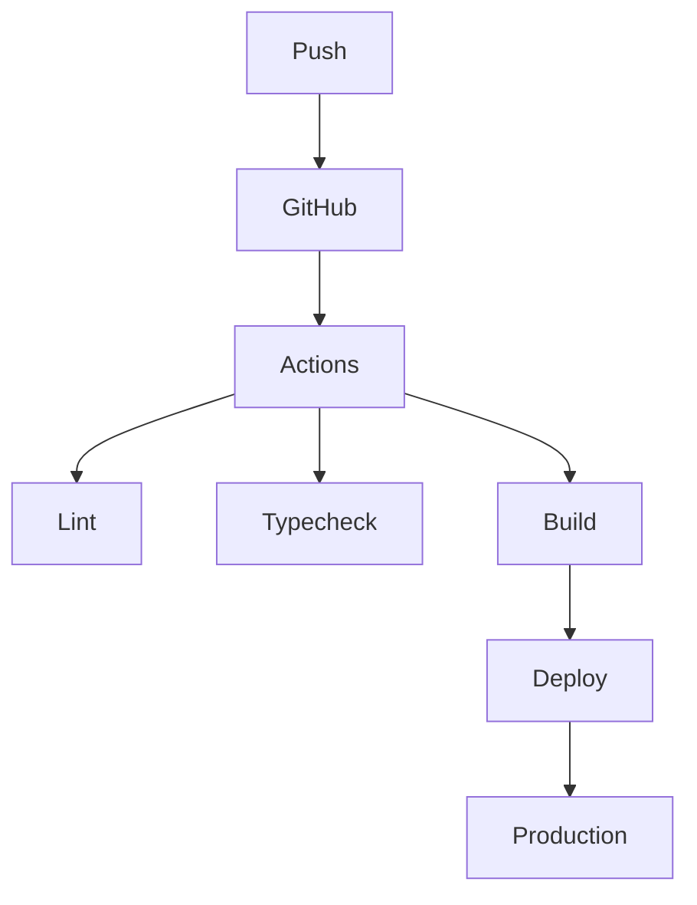
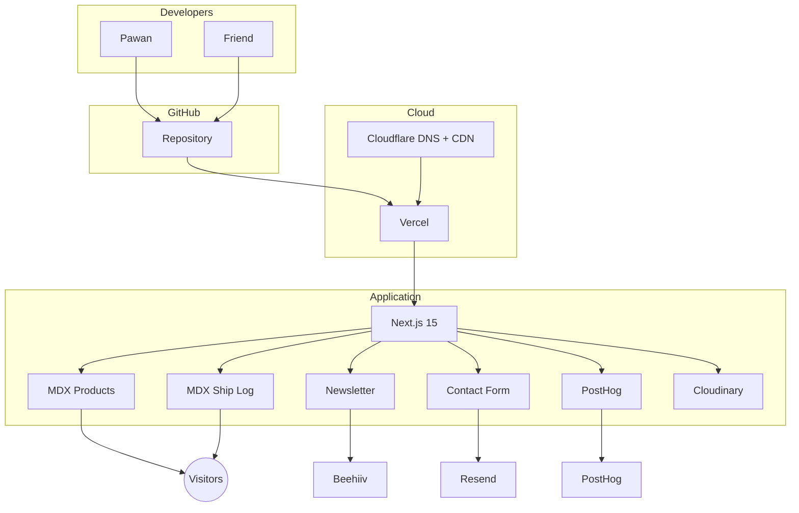

# Promethix Lab Architecture

> Version: 1.0  
> Last Updated: July 2026

## Overview

Promethix Lab is a **content-driven studio website** that showcases products, publishes a public shipping log, and grows an audience through a newsletter.

### Goals

- Fast static website
- Excellent SEO
- Zero infrastructure maintenance
- Git-based content workflow
- Automatic deployments
- Easy collaboration

---

# Tech Stack

| Layer | Technology |
|--------|------------|
| Framework | Next.js 15 (App Router) |
| Language | TypeScript |
| Styling | Tailwind CSS |
| Components | shadcn/ui |
| Animation | Framer Motion |
| Icons | Lucide React |
| Hosting | Vercel |
| DNS/CDN | Cloudflare |
| Source Control | GitHub |
| Content | MDX + Content Collections |
| Newsletter | Beehiiv |
| Contact Emails | Resend |
| Analytics | PostHog |
| Error Monitoring | Sentry |
| Uptime | Better Stack |
| Images | Cloudinary |
| Spam Protection | Cloudflare Turnstile |

---

# Folder Structure

```text
promethixlab/

app/
├── page.tsx
├── products/
│   ├── page.tsx
│   └── [slug]/page.tsx
├── shiplog/
├── about/
├── contact/
├── api/
│   ├── newsletter/
│   └── contact/

components/
content/
├── products/
├── shiplog/

lib/
emails/
public/
styles/
```

---

# Product Content

Each product is an MDX file.

```md
---
title: Pocket Ledger
slug: pocket-ledger
category: Finance
status: Live
date: 2026-07-03
website: https://...
github: https://...
featured: true
---

# Pocket Ledger

Description

## Features

## Tech Stack

## Lessons Learned
```

---

# Product Publishing Flow



---

# Newsletter Flow

Beehiiv manages subscribers and email campaigns.



---

# Contact Flow

```mermaid
flowchart TD

A[Visitor]
--> B[Contact Form]

B --> C[Server Action]

C --> D[Resend]

D --> E[hello@promethixlab.com]
```

---

# Deployment Flow



---

# Collaboration



---

# CI/CD



---

# Third Party Services

| Purpose | Service |
|---------|----------|
| Hosting | Vercel |
| DNS | Cloudflare |
| Git | GitHub |
| Newsletter | Beehiiv |
| Email | Resend |
| Analytics | PostHog |
| Monitoring | Better Stack |
| Errors | Sentry |
| Images | Cloudinary |
| Captcha | Cloudflare Turnstile |

---

# Environment Variables

```env
BEEHIIV_API_KEY=
BEEHIIV_PUBLICATION_ID=

RESEND_API_KEY=

POSTHOG_KEY=

NEXT_PUBLIC_SITE_URL=

CLOUDINARY_CLOUD_NAME=

SENTRY_AUTH_TOKEN=
```

---

# Scaling Strategy

| Stage | Architecture |
|--------|--------------|
| Today | Static MDX |
| 100 Products | Content Collections |
| 1000 Products | PostgreSQL + Prisma |
| 10k Users | Redis + Background Jobs |
| 100k Users | Edge Caching + Search |

---

# Master Architecture Diagram



---

# Why This Architecture?

- No database required initially.
- Entire site is version-controlled.
- Every push automatically deploys.
- Excellent SEO through static generation.
- Easy collaboration.
- Low maintenance.
- Can scale incrementally without rewrites.

